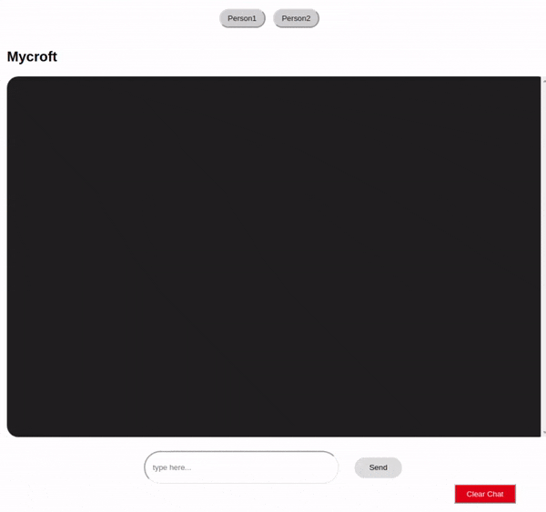

# **Front-end State Management using RxJS and React Hooks**

RxJS (Reactive Extensions Library for JavaScript) is a useful library for reactive programming. The RxJS documentation uses this definition:

RxJS is a library for reactive programming using Observables, to make it easier to compose asynchronous or callback-based code.

Reactive programming is an event-based paradigm that allows us to run asynchronous sequences of events as soon as data is pushed to a consumer.

To be able to use RxJS for state management in React, it is important to understand the following key terms:

**Observable**
An Observable is a data stream that houses data that can be passed through different threads. In our demo app, we’ll be using an Observable to supply data to our different components.

**Observer**
An Observer consumes the data supplied by an Observable. In our demo app, we’ll be using our setState Hook to consume data from our Observable.

**Subscription**
In order for our Observer to consume data from our Observable, we’ll have to subscribe it to the Observable. In our demo app, we’ll be using the subscribe() method to subscribe our setState Observer to our Observable.

